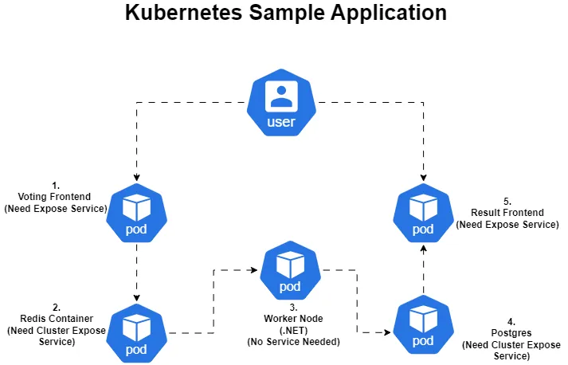

### Voting Application on Kubernetes

This Voting Application consists of multiple components that interact with each other to provide a frontend for voting, a backend worker to process the votes, and a result frontend to display the votes. The services are deployed on Kubernetes, with some components exposed as services to interact with the users.

### Reference url

https://github.com/dockersamples/example-voting-app

### Application Architecture Overview



#### Components

1. **Voting Frontend**

   - **Pod:** Frontend for users to submit votes.
   - **Exposed Service:** Yes, needs to be exposed as a service to allow user interaction.

2. **Redis Container**

   - **Pod:** Redis is used as a caching layer to store vote counts temporarily.
   - **Exposed Service:** Yes, needs a cluster-level expose service for communication with other components (like the worker node).

3. **Worker Node (.NET)**

   - **Pod:** A .NET backend worker that processes the votes.
   - **Exposed Service:** No service exposure is required for this component as it communicates internally with Redis and Postgres.

4. **Postgres**

   - **Pod:** Database for persistent storage of the votes.
   - **Exposed Service:** Yes, needs a cluster-level expose service for communication with the worker node.

5. **Result Frontend**
   - **Pod:** Displays the result of the votes for users.
   - **Exposed Service:** Yes, needs to be exposed as a service to allow user interaction.

### Kubernetes Components

- **Pods:** Each component (Voting Frontend, Redis, Worker Node, Postgres, Result Frontend) runs inside its own pod.
- **Services:** The Voting Frontend, Redis, Postgres, and Result Frontend are exposed using Kubernetes services.

### Deployment Overview

- **Voting Frontend** is exposed to users so they can vote.
- **Redis** temporarily stores votes before they are processed.
- **Worker Node** processes the votes and stores them in **Postgres**.
- **Result Frontend** retrieves the stored votes from **Postgres** and displays them to users.

### Kubernetes Commands

To apply the services and deployments, run the following commands:

```bash
kubectl apply -f vote-deployment.yaml
kubectl apply -f redis-deployment.yaml
kubectl apply -f worker-deployment.yaml
kubectl apply -f db-deployment.yaml
kubectl apply -f result-deployment.yaml
```

### Exposing Services

You need to expose the Voting Frontend, Redis, Postgres, and Result Frontend components as services. Example commands to expose the services:

```bash
kubectl apply -f vote-service.yaml
kubectl apply -f redis-service.yaml
kubectl apply -f worker-service.yaml
kubectl apply -f db-service.yaml
kubectl apply -f result-service.yaml
minicube service vote-service result-service
```

### Conclusion

This workflow represents the interaction of different components of the Voting Application in a Kubernetes environment. Each pod runs a specific part of the application, and the services ensure that the necessary components are accessible and connected correctly within the cluster.
